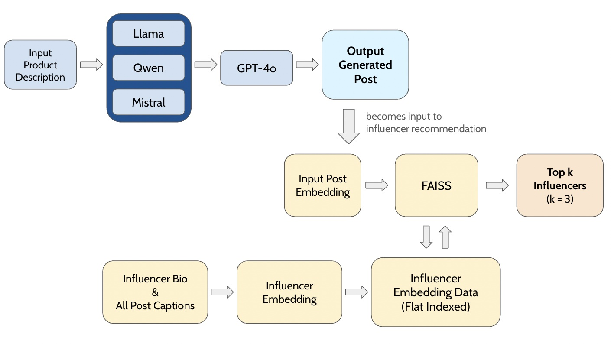

# InstaAIModel: Automating Ad-Content Generation and Influencer Selection for Instagram Marketing

## Project Overview
This project automates 2 core tasks in Instagram influencer marketing:
1. Post Generation - Uses instruction-tuned LLMs to generate realistic, influencer-style sponsored posts from product descriptions.
2. Influencer Recommendation - Identifies the top-k influencers whose style aligns best with a given product post using SBERT embeddings and FAISS similarity search.

Our pipeline uses GPT-4o to synthesize outputs from LLaMA-3.1-8B-Instruct, Qwen2.5-7B-Instruct, and Mistral-7B-Instruct-v0.3 for post generation. SBERT and FAISS are utilized are influencer retrieval. Evaluation was conducted using both GPT-o1 as a judge model and human evaluation. We intend this approach to be a scalable solution for social media marketing automation.



## Setup
### 1. Clone the Repository
```sh
git clone https://github.com/hjjyhj/InstaAIModel.git
cd InstaAIModel
```
**Important**: Clone into your home directory, not the shared directory mentioned below.

### 2. Conda Environment
Miniconda3 installed. You can make that conda environment as default by
```sh
cd /scratch/eecs487w25_class_root/eecs487w25_class/shared_data/johnkimm_dir/
export PATH="/scratch/eecs487w25_class_root/eecs487w25_class/shared_data/johnkimm_dir/miniconda3/bin:$PATH"
source ~/.bashrc
```
Check with 
```sh
which conda
```
This should show the path within `johnkimm_dir/miniconda3`.
Note that is where all the data that we need will be shared. 

You can activate the conda environment by 
```sh
conda activate my_env
```
Make sure to activate `my_env`, since all the dependencies are already downloaded there.

### 3. Install Required Packages
```sh
cd /home/<your_directory>/InstaAIModel
pip install -r requirements.txt
```

### Important Note: Shared Data Deletion
Everything in the shared directory `/scratch/eecs487w25_class_root/eecs487w25_class/shared_data` will be deleted in 60 days if the files were not used.
Make sure to save files that you need to your home directory.


## Directory Structure

| Folder  | Description |
| ------------- | ------------- |
| model_download_train  | Contains scripts for downloading, checking, and fine-tuning the language models (LLaMA, Qwen, and Mistral)  |
| post_generation  | Handles the generation and evaluation of Instagram-style posts using the trained models. Includes prompt inputs, raw and refined outputs, and scripts for running and comparing generations.  |
| run_models  | Implements the influencer recommendation pipeline. It generates SBERT embeddings for influencer profiles, builds FAISS indexes, and retrieves top-k influencers based on similarity to generated posts.  |


## Run the Post Generation
```sh
cd /home/<your_directory>/InstaAIModel/post_generation
python run_post_generation.py
```
- This script reads input products from `all_input_product_desc.json`
- Outputs from each model are saved to `smaller_models_output.json` or `untuned_output.json`, depending on whether we are prompting the fine-tuned or untuned version
- Users can change input product descriptions
- Optional GPT-4o synthesizing can be enabled at the end of the script

## Run the Influencer Recommendation
```sh
cd /home/<your_directory>/InstaAIModel/recommend_influencer
python run_FAISS.py
```
- Loads a pre-built FAISS index and influencer embeddings
- Encodes a sample post using SBERT (`all-MiniLM-L12-v2`)
- Returns the top k most semantically similar influencer names
- Users can edit the `query_text` to try different inputs

## Dataset
### Influencer and Brand Dataset: Sponsorship Detection
- Collected by Professor Seungbae Kim (University of South Florida)
- 1.6 M Instagram posts that mention 26,910 brand names and were published by 38,113 influencers
- [Link to Request the Dataset](https://sites.google.com/site/sbkimcv/dataset/instagram-influencer-dataset?authuser=0)

We used the full dataset for training, as tasks like post generation and influencer recommendation do not have a single correct output. The dataset was split into three equal parts to fine-tune each smaller language model (Llama, Qwen, Mistral) individually, allowing them to learn diverse influencer styles.

## Our Team
- Ho Jung Kim
- Hannah Sun
- Xinyi Li
- Amira Said